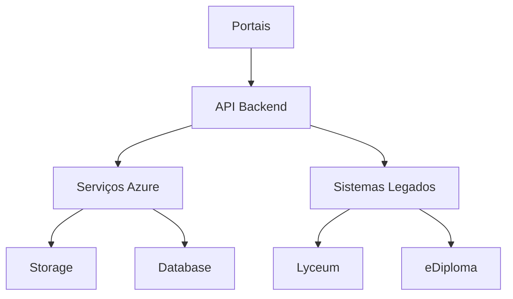

# Documento de Iniciação do Projeto - Diploma Digital

## 1. Visão Geral do Projeto

### 1.1. Contexto Atual
O processo de emissão de diplomas digitais é atualmente um fluxo de trabalho manual, fragmentado e com alto risco operacional. As atividades dependem de:
- Múltiplas ferramentas:
  - E-mail
  - Microsoft Word
  - WhatsApp
  - Sistema Lyceum
- Etapas manuais de:
  - Conversão
  - Nomeação de arquivos
  - Digitação de dados

Problemas identificados:
- Lentidão no processo
- Potencial para erros humanos que podem invalidar lotes inteiros
- Falta de transparência para o aluno
- Riscos de segurança da informação

### 1.2. Visão do Produto
Criar uma solução digital integrada que:
- Se integre aos portais existentes:
  - Portal do Aluno
  - Portal Administrativo
- Automatize e centralize todo o ciclo de vida da emissão do diploma digital
- Orquestre o fluxo completo:
  - Desde a solicitação do aluno
  - Até a entrega final do diploma assinado
- Transforme o processo em uma experiência eficiente, segura e transparente

### 1.3. Objetivos do Negócio
1. **Eficiência Operacional**
   - Reduzir em 80% o tempo gasto no processo de emissão de cada diploma

2. **Qualidade e Confiabilidade**
   - Eliminar erros de formatação e nomeação de arquivos através da automação

3. **Segurança da Informação**
   - Centralizar todos os documentos e dados sensíveis
   - Aumentar a segurança do processo

4. **Experiência do Usuário**
   - Melhorar a experiência do aluno
   - Oferecer total transparência sobre o status da solicitação

## 2. Escopo do Projeto

### 2.1. Escopo Incluso (MVP)

#### 2.1.1. Módulo do Aluno (Portal do Aluno)
- **Solicitação**
  - Formulário de solicitação de diploma
  - Upload de documentos
    - RG
    - Certificado do Ensino Médio
    - Outros documentos necessários
- **Acompanhamento**
  - Visualização simplificada do status da solicitação

#### 2.1.2. Módulo Administrativo (Portal Administrativo)
- **Gestão de Solicitações**
  - Tela de análise centralizada
    - Visualização integrada de dados do aluno
    - Acesso a todos os documentos enviados
  - Sistema de aprovação/reprovação
    - Inclusão de justificativa quando necessário
- **Geração de Documentos**
  - Geração de pacote .zip para download
    - Arquivos CSV formatados
    - Arquivos PDF formatados
    - Nomenclatura padronizada automática

#### 2.1.3. Automações do Sistema
- **Processamento de Documentos**
  - Conversão automática para PDF-A
- **Validações Automáticas**
  - Verificação da situação acadêmica no Lyceum
  - Verificação da situação financeira no Lyceum

### 2.2. Escopo Não Incluso (Fase Futura)

#### 2.2.1. Integrações Avançadas
- Integração via API com sistema eDiploma
  - *Pendente de investigação técnica*

#### 2.2.2. Funcionalidades Adicionais
- Assinatura digital automática de termos
- Dashboard com métricas e indicadores
- Mecanismos avançados de antifraude documental

### 2.3. Entregas Principais
1. Portal do Aluno
   - Interface de solicitação
   - Sistema de upload
   - Acompanhamento de status

2. Portal Administrativo
   - Interface de análise
   - Sistema de aprovação
   - Gerador de pacotes

3. Sistema de Automação
   - Conversor de documentos
   - Validador automático
   - Gerador de nomenclatura

## 3. Partes Interessadas (Stakeholders)

### 3.1. Stakeholders Principais

#### 3.1.1. Usuária Principal
Ver seção 4 para detalhes completos da persona principal.

#### 3.1.2. Alunos Concluintes
- **Papel**: Usuários finais do sistema
- **Interações**:
  - Solicitação do diploma
  - Upload de documentos
  - Acompanhamento do processo
- **Necessidades**:
  - Interface intuitiva
  - Processo transparente
  - Atualizações de status claras

### 3.2. Equipe do Projeto

#### 3.2.1. Product Owner (Diploma Digital)
- **Responsabilidades**:
  - Definição da visão do produto
  - Gestão do backlog
  - Garantia de entrega de valor
  - Priorização de funcionalidades

#### 3.2.2. Equipe de TI / Desenvolvimento
- **Responsabilidades**:
  - Implementação do sistema
  - Realização de testes
  - Manutenção do sistema
- **Áreas de Atuação**:
  - Desenvolvimento frontend (Portais)
  - Desenvolvimento backend
  - Automações e integrações

### 3.3. Matriz de Comunicação
| Stakeholder | Interesse | Impacto | Frequência de Comunicação |
|------------|-----------|---------|------------------------|
| Ana Oliveira | Alto | Alto | Diária/Semanal |
| Alunos Concluintes | Médio | Alto | Por demanda |
| Product Owner | Alto | Alto | Diária |
| Equipe de TI | Alto | Alto | Diária |

## 4. Persona do Usuário

### 4.1. Perfil: "A Especialista do Processo"
*(Persona fictícia criada para guiar o desenvolvimento)*

#### Dados Básicos
- **Nome**: Ana Oliveira
- **Cargo**: Analista Administrativa
- **Setor**: Registro Acadêmico
- **Idade**: 38 anos
- **Localização**: Fortaleza, Ceará

#### Perfil Profissional
Ana é uma profissional dedicada e detalhista, responsável pelo processo de emissão do diploma digital. Ela conhece cada etapa e regra de negócio, mas sente-se sobrecarregada pelas tarefas manuais e repetitivas. Está ansiosa por uma solução que traga mais segurança e eficiência para seu trabalho.

#### Objetivos (Goals)
1. **Precisão**
   - Emitir diplomas sem erros
   - Garantir conformidade com requisitos

2. **Eficiência**
   - Reduzir o tempo gasto por solicitação
   - Automatizar tarefas repetitivas

3. **Centralização**
   - Gerenciar tudo em uma única interface
   - Eliminar troca constante entre sistemas

4. **Segurança**
   - Garantir proteção de dados sensíveis
   - Manter registro de todas as operações

#### Frustrações (Pain Points)
1. **Processo Fragmentado**
   > "Eu preciso usar e-mail, Word, WhatsApp, o sistema Lyceum e o site do eDiploma. É muita troca de janelas!"
   - Múltiplas ferramentas
   - Fluxo de trabalho desconexo
   - Dificuldade de rastreamento

2. **Trabalho Manual**
   - Conversão manual de arquivos
   - Renomeação individual de documentos
   - Processos repetitivos

3. **Risco de Erro**
   - Preocupação constante com erros humanos
   - Pressão por precisão
   - Volume alto de trabalho

#### Citação Representativa
> "Meu maior medo é deixar passar um detalhe por causa da correria. Se o sistema pudesse cuidar da parte repetitiva, meu trabalho seria muito mais estratégico e seguro."

## 5. Requisitos Funcionais (Backlog de Épicos)

### 5.1. Épico 1: Solicitação e Acompanhamento do Aluno
*Objetivo: Permitir que o aluno inicie e acompanhe o processo de emissão do diploma de forma autônoma*

#### Histórias de Usuário
- **[HU-01]** Solicitação de Diploma
  - Como: aluno
  - Quero: solicitar meu diploma e anexar documentos pelo portal
  - Para: iniciar o processo de emissão do meu diploma

- **[HU-02]** Acompanhamento de Status
  - Como: aluno
  - Quero: acompanhar o status da minha solicitação
  - Para: me manter informado sobre o andamento do processo

### 5.2. Épico 2: Análise e Validação Administrativa
*Objetivo: Centralizar e otimizar o processo de análise documental*

#### Histórias de Usuário
- **[HU-03]** Interface Centralizada de Validação
  - Como: analista (Ana)
  - Quero: ter uma tela única para validar todos os dados e documentos do aluno
  - Para: aumentar a eficiência e reduzir erros no processo de análise

- **[HU-04]** Gestão de Pendências
  - Como: analista (Ana)
  - Quero: poder reprovar um documento e notificar o aluno sobre a pendência
  - Para: garantir a conformidade da documentação

### 5.3. Épico 3: Geração de Arquivos e Envio para o eDiploma
*Objetivo: Automatizar a preparação e envio de documentos*

#### Histórias de Usuário
- **[HU-05]** Geração Automática de CSVs
  - O sistema deve gerar automaticamente os arquivos CSV
  - Dados inclusos:
    - Dados pessoais
    - Histórico acadêmico

- **[HU-06]** Processamento de Documentos
  - O sistema deve:
    - Gerar documentos em formato PDF-A
    - Nomear arquivos automaticamente
    - Seguir padrões estabelecidos

- **[HU-07]** Integração com eDiploma
  - O sistema deve permitir o envio do lote de arquivos para o eDiploma

### 5.4. Épico 4: Entrega do Diploma ao Aluno
*Objetivo: Finalizar o processo com a disponibilização do diploma ao aluno*

#### Histórias de Usuário
- **[HU-08]** Gestão do Retorno
  - O sistema deve armazenar o retorno do eDiploma

- **[HU-09]** Acesso ao Diploma Digital
  - Como: aluno
  - Quero: acessar o link do meu diploma finalizado no portal
  - Para: ter acesso ao meu diploma digital oficial

### 5.5. Matriz de Priorização
| ID | História | Valor de Negócio | Complexidade | Prioridade |
|----|----------|------------------|--------------|------------|
| HU-01 | Solicitação de Diploma | Alto | Média | 1 |
| HU-02 | Acompanhamento | Alto | Baixa | 2 |
| HU-03 | Interface Centralizada | Alto | Alta | 1 |
| HU-04 | Gestão de Pendências | Médio | Média | 2 |
| HU-05 | Geração de CSVs | Alto | Alta | 1 |
| HU-06 | Processamento PDF-A | Alto | Alta | 1 |
| HU-07 | Integração eDiploma | Alto | Alta | 2 |
| HU-08 | Gestão do Retorno | Médio | Média | 3 |
| HU-09 | Acesso ao Diploma | Alto | Baixa | 3 |

## 6. Requisitos Não Funcionais

### 6.1. Segurança e Conformidade
- **Proteção de Dados (LGPD)**
  - Armazenamento seguro de documentos
  - Controle de acesso granular
  - Registro de auditoria de acessos
  - Criptografia de dados sensíveis

- **Conformidade MEC**
  - Geração de arquivos no formato PDF-A
  - Validação automática do formato
  - Conformidade com padrões do MEC

### 6.2. Usabilidade
- **Interface do Usuário**
  - Design intuitivo
  - Minimização de cliques
  - Feedback claro de ações
  - Ajuda contextual
  - Minimização da necessidade de treinamento

### 6.3. Integração e Interoperabilidade
- **Sistema Lyceum**
  - Integração robusta para dados acadêmicos
  - Consulta em tempo real de situação financeira
  - Sincronização eficiente de dados

## 7. Metodologia e Ferramentas

### 7.1. Metodologia Ágil
- **Framework Scrum**
  - Sprints de 2 semanas
  - Entregas contínuas de valor
  - Validações periódicas com usuários

### 7.2. Ferramentas
- **Gestão de Projeto**
  - Jira para gestão do backlog
  - Acompanhamento de sprints
  - Documentação técnica

## 8. Riscos e Dependências

### 8.1. Riscos Externos (Alto Impacto)
- **Integração eDiploma**
  - **Risco**: Ausência de API/Web Service
  - **Impacto**: Impossibilidade de automação completa
  - **Mitigação**: 
    1. Investigação técnica inicial (Spike)
    2. Plano B com upload manual no MVP
    3. Negociação com fornecedor

### 8.2. Dependências Internas
- **Equipe de TI**
  - Acesso ao banco Lyceum
  - Suporte para integrações
  - Disponibilidade da equipe

### 8.3. Plano de Mitigação
- Priorização de investigações técnicas
- Desenvolvimento de alternativas manuais
- Comunicação prévia com stakeholders

## 9. Arquitetura Técnica

### 9.1. Princípios Arquiteturais
1. **Integração e Reutilização**
   - Módulo integrado aos portais existentes
   - Aproveitamento de componentes atuais
   - Padronização de interfaces

2. **Arquitetura Orientada a Serviços**
   - API centralizada para regras de negócio
   - Separação clara de responsabilidades
   - Facilidade de manutenção

3. **Segurança por Design**
   - Conformidade LGPD desde a concepção
   - Princípio do menor privilégio
   - Auditoria completa de operações

## 10. Visão Geral da Arquitetura

### 10.1. Arquitetura de Alto Nível
A solução utiliza uma arquitetura distribuída em camadas, composta por:
- Frontend (Portais)
- Backend (API Central)
- Serviços Cloud (Azure)

## 11. Detalhamento dos Componentes

### 11.1. Camada de Apresentação (Frontend)
- **Tecnologia**: React com Next.js (TypeScript)
- **Componentes**:
  - Portal do Aluno
    - Interface de solicitação
    - Upload de documentos
    - Acompanhamento de status
  - Portal Administrativo
    - Dashboard de análise
    - Gestão de solicitações
    - Validação de documentos

### 11.2. Camada de Aplicação (Backend / API)
- **Tecnologia**: Node.js com NestJS (TypeScript)
- **Responsabilidades**:
  - Orquestração do fluxo
  - Aplicação de regras de negócio
  - Geração de arquivos
  - Gestão de integrações

### 11.3. Camada de Dados e Serviços (Microsoft Azure)
- **Banco de Dados**
  - Azure SQL Database
  - Dados do processo
  - Logs e auditoria

- **Armazenamento**
  - Azure Blob Storage
  - Documentos dos alunos
  - Backups e arquivos temporários

- **Processamento**
  - Azure Functions
  - Conversão para PDF-A
  - Processamento assíncrono

## 12. Integrações

### 12.1. Sistema Acadêmico (Lyceum)
- **Método**: Leitura direta do banco de dados
- **Dados Acessados**:
  - Informações acadêmicas
  - Situação financeira
  - Dados cadastrais

### 12.2. Sistema eDiploma
- **Plano A (Ideal)**
  - Integração via API
  - Envio automático de lotes
  - Recebimento de status

- **Plano B (MVP)**
  - Geração de arquivo .zip
  - Upload manual
  - Processo assistido

## 13. Tecnologias e Infraestrutura

### 13.1. Stack de Desenvolvimento
| Camada | Tecnologia | Versão |
|--------|------------|---------|
| Frontend | React/Next.js | TypeScript |
| Backend | Node.js/NestJS | TypeScript |
| Database | SQL Server | Azure Managed |

### 13.2. Infraestrutura Cloud (Azure)
- **Computação**
  - Azure App Service
    - Hospedagem Frontend
    - Hospedagem API

- **Armazenamento**
  - Azure Blob Storage
    - Documentos
    - Arquivos do sistema

- **Banco de Dados**
  - SQL Database
    - Dados transacionais
    - Backups automatizados

- **Processamento**
  - Azure Functions
    - Conversões
    - Jobs assíncronos

- **Segurança**
    - Azure Active Directory
    - Autenticação centralizada
    - Gestão de acessos
    - Single Sign-On

## 14. Métricas de Sucesso (KPIs)

### 14.1. KPIs Operacionais
- **Tempo de Processamento**
  - Atual: ~2-3 horas por solicitação
  - Meta MVP: Redução para 30 minutos
  - Meta Final: Redução para 15 minutos

- **Taxa de Erro**
  - Atual: ~15% de retrabalho
  - Meta MVP: Menos de 5%
  - Meta Final: Menos de 1%

- **Volume de Processamento**
  - Capacidade atual: X solicitações/dia
  - Meta MVP: 3X solicitações/dia
  - Meta Final: 5X solicitações/dia

### 14.2. KPIs de Satisfação
- **NPS do Aluno**
  - Meta MVP: > 7
  - Meta Final: > 8.5

- **Satisfação da Analista**
  - Redução de 80% nas tarefas manuais
  - Eliminação de troca entre sistemas

## 15. Plano de Implantação e Transição

### 15.1. Estratégia de Rollout
1. **Fase Piloto** (2 semanas)
   - Grupo inicial: 5-10 solicitações
   - Usuária principal operando com suporte total
   - Ajustes rápidos baseados no feedback

2. **Expansão Controlada** (2 semanas)
   - Aumento para 25-30 solicitações
   - Operação paralela com sistema atual
   - Refinamentos de usabilidade

3. **Transição Completa** (1 semana)
   - Migração de todas as novas solicitações
   - Sistema atual mantido para consulta
   - Suporte dedicado no local

### 15.2. Suporte à Transição
- **Treinamento**
  - Sessões hands-on com a usuária
  - Material de consulta rápida
  - Vídeos de procedimentos comuns

- **Suporte Dedicado**
  - Equipe on-site na primeira semana
  - Canal direto com desenvolvimento
  - Monitoramento em tempo real

### 15.3. Plano de Contingência
- Sistema atual mantido ativo
- Processo de rollback documentado
- Pontos de decisão para continuidade

### 15.4. Critérios de Sucesso da Implantação
1. Zero perda de dados
2. Sem interrupção de serviço
3. Usuária operando independentemente
4. Tempo de processamento dentro da meta
5. Satisfação da usuária atingida

---
## Histórico de Revisões
| Data | Versão | Descrição | Autor |
|------|---------|-----------|--------|
| 2025-11-05 | 1.0 | Versão inicial | - |